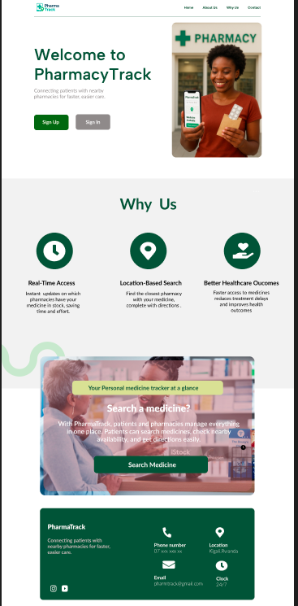

# Pharmatrack

Pharmatrack connects patients with nearby pharmacies for faster and easier care. Users can register, login, and find pharmacies quickly. Admins can manage pharmacies and medications..

## Table of Contents

1. [Project Overview](#project-overview)
2. [Features](#features)
3. [Technologies Used](#technologies-used)
4. [Setup Instructions](#setup-instructions)
5. [Database Schema](#database-schema)
6. [Designs](#designs)
7. [Deployment Plan](#deployment-plan)
8. [Demo Video](#demo-video)
9. [Repository Link](#repository-link) 10.[Deployed Links](#deployed-links)

## Project Overview

Pharmatrack aims to simplify access to pharmacies for patients by providing a user-friendly interface to locate and interact with pharmacies nearby. The app handles user authentication, pharmacy listings, and basic administrative management.

## Features

- **User Features:**
  - User registration and login
  - View nearby pharmacies
  - Search and filter pharmacies

- **Admin Features:**
  - Add, update, and delete pharmacies
  - Manage medications
  - View user activity

## Technologies Used

- **Frontend:** React.js, Typesrcipt,Tailwind
- **Backend:** Django, Django REST Framework
- **Database:** MongoDB
- **Deployment:** Netlify (Frontend), Render (Backend)

## Setup Instructions

### Backend

1. Navigate to the backend folder:
   ```bash
   cd Backend
   ```
2. Create a virtual environment

   ```bash
   source venv/bin/activate
   ```

3.Install dependencies

    ```bash
    pip install -r requirements.txt

    ```

4. Apply migrations

   ```bash
   python manage.py migrate

   ```

5. Start the Django server

   ```bash
   python manage.py runserver

   ```

### Frontend

1. Navigate to the frontend folder

   ```bash
   cd Frontend

   ```

2. Install dependencies

   ```bash
   npm install

   ```

3. Start the development server

   ```bash
   npm run dev

   ```

## Database Schema

PharmacyTrack uses MongoDB to store application data. Below is an overview of the main collections and their fields:
Users: CustomUser model (username, fullnames,email,password, role)

Pharmacies: name, address, contact info, location coordinates

Medications: name, quantity, associated pharmacy

## Designs

Figma Mockups: https://www.figma.com/design/eYLyILukjfF63oryleSVjA/pharmatrack-mockup?node-id=1-37&t=STFuDZwDQBQVhN19-1

Screenshots of app interfaces:



## Deployment Plan

Backend hosted on: [Render]

Frontend hosted on: [Netlify]

MongoDB hosted on: [MongoDBCompass]

## Demo Video

Watch a 5–10 minute demonstration of Pharmatrack’s functionality:
Link : https://www.youtube.com/watch?v=veYHoQDyXLY
Final version of my product : https://youtu.be/Df-kgRvOu5c

## Repo Link

```bash
  https://github.com/IBIRASA/Pharmatrack

```

## Live Links

### Backend

```bash
https://pharmatrack-wb0c.onrender.com

```

### Frontend

```bash

https://pharmatrackk.netlify.app/

```
